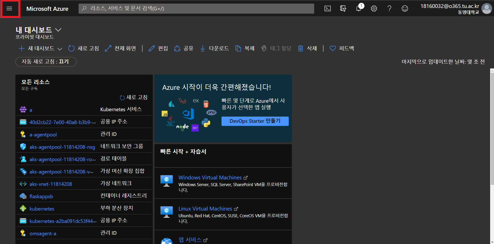
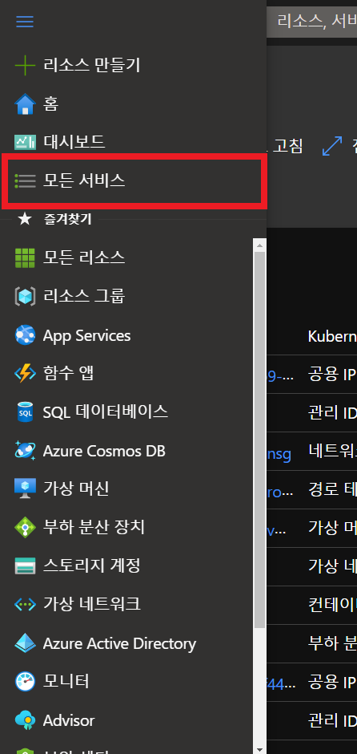
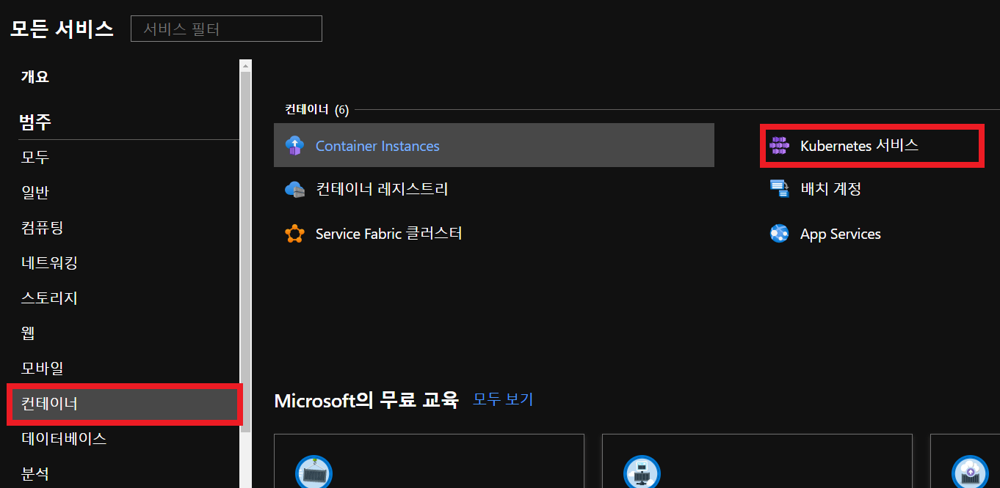
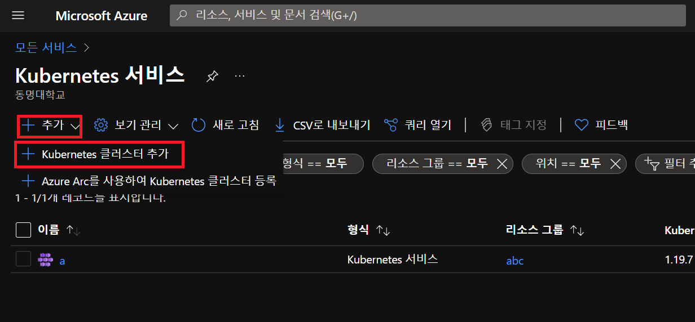
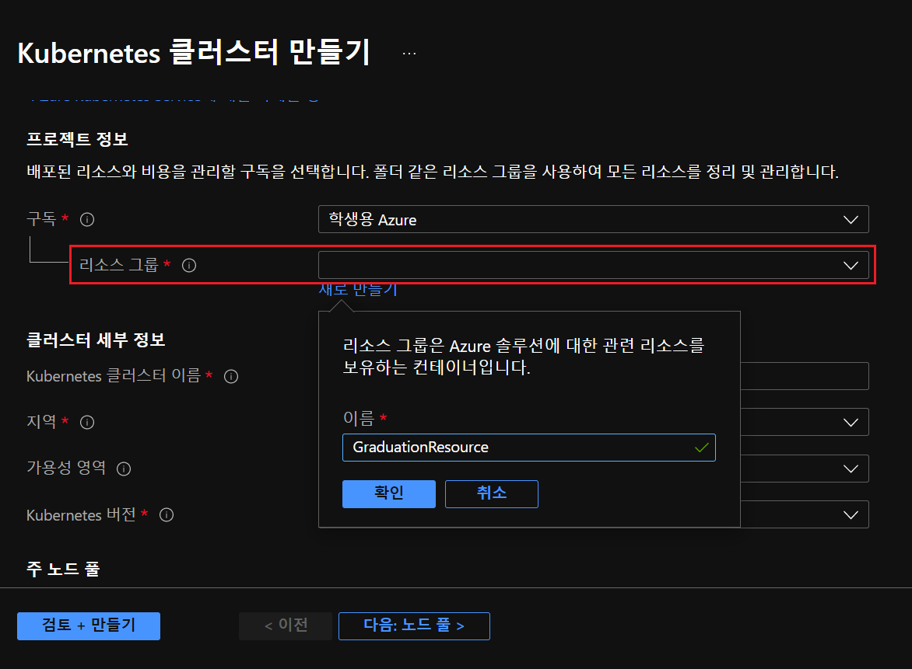
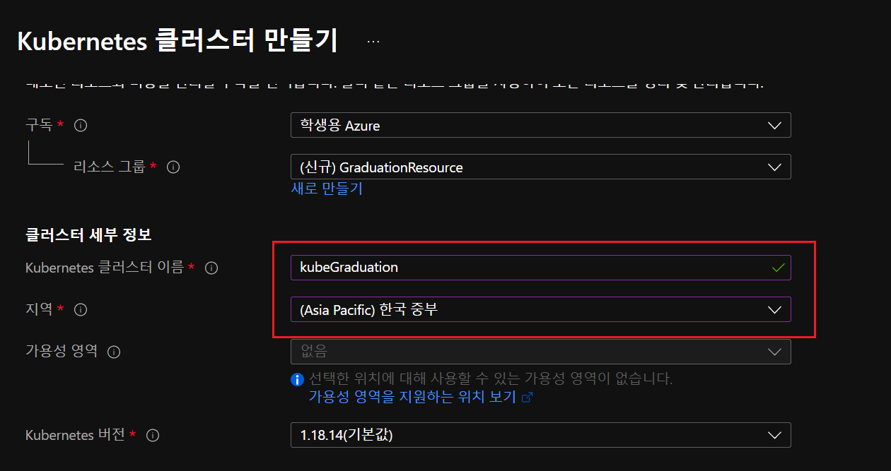
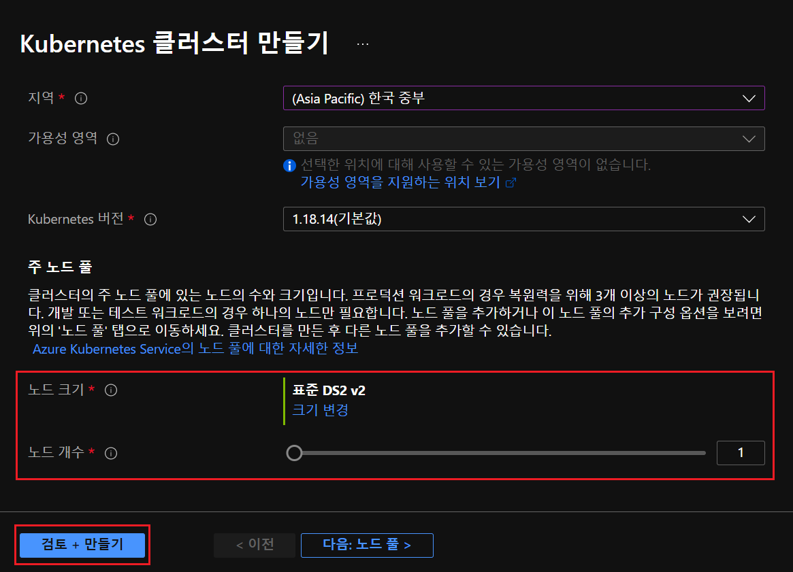
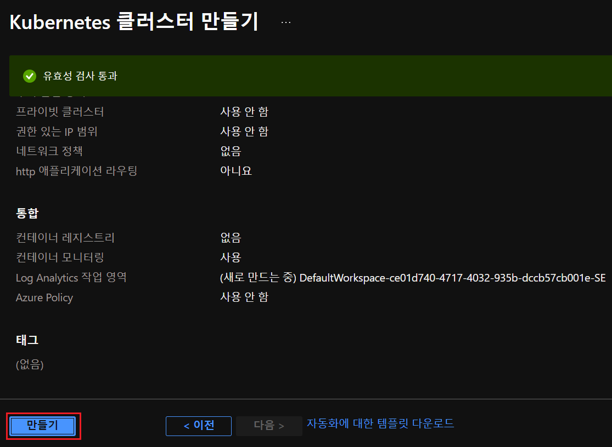
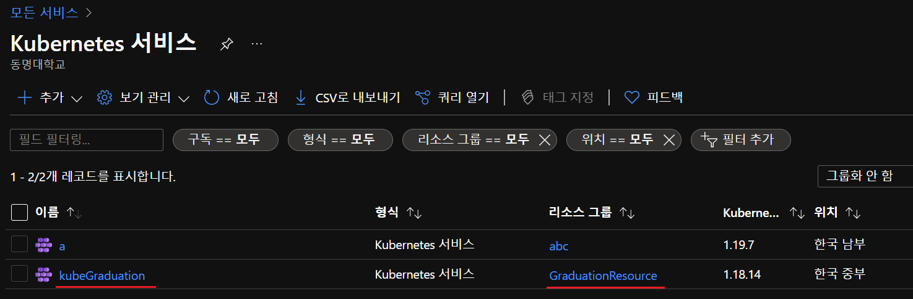

# AKS

## 로그인

[azure](https://portal.azure.com/) 사이트에 들어가 로그인 해준다.

## 쿠버네티스 클러스터 생성

위의 버튼을 누르면 아래의 리스트가 뜸

쿠버네티스 서비스에 진입

쿠버네티스 쿨러스터를 추가

자신이 원하는 ResourceGroup 이름을 설정 (나중에 azure-cli 에 필요함)

자신이 원하는 Kubernetes Cluster 이름 설정 (나중에 azure-cli 에 필요함)

한국 서버로 설정

노드 수가 1개일 경우 학생플랜은 무료이므로 1개로 수정

검토 및 만들기를 눌러 생성가능한지 확인

몇분후 Kubernetes Cluster 완성

